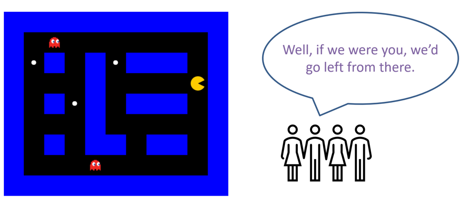
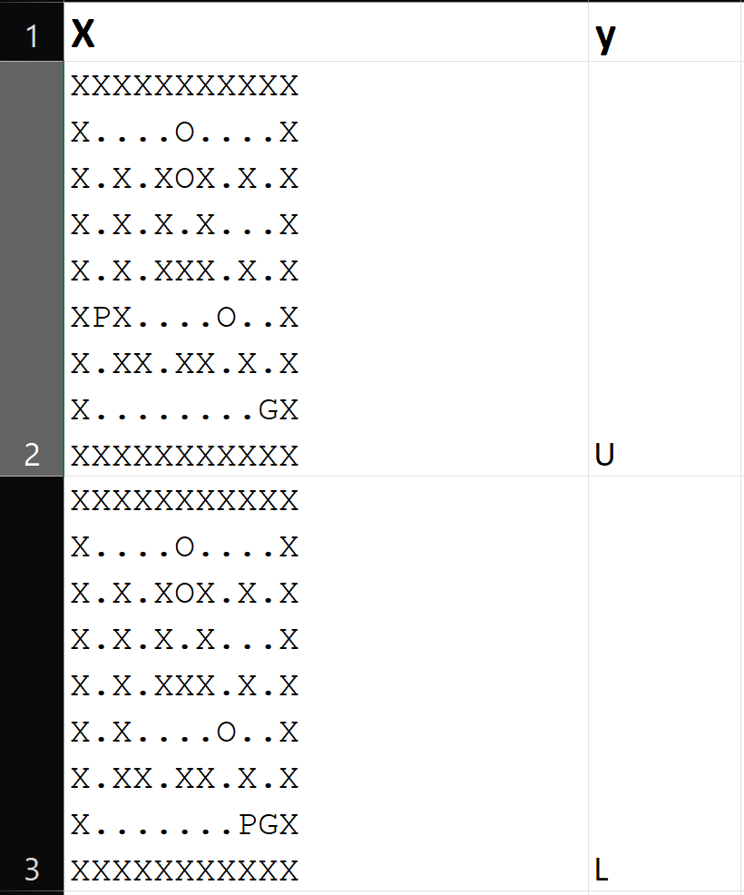
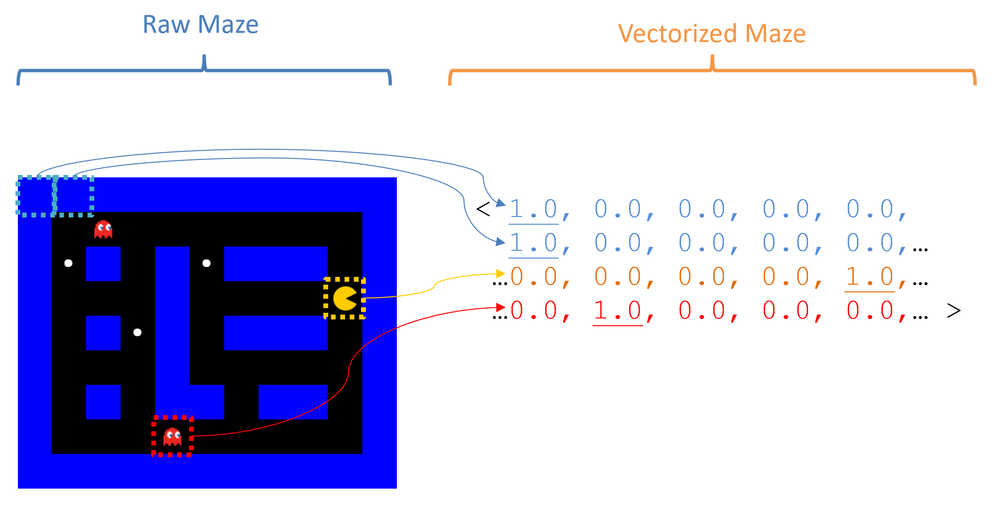

# Pacman Trainer Exercise

This classwork will give you some practice with the applied aspects of neural networks in supervised imitation learning!

## Premise

**Your task:** Collect training data as a class around which you will develop a neural-network imitation-learning Pacman player!

**Imitation Learning** systems are those in which some complex behavior is approximated by imitating human reactions to similar stimuli.

For playing Pacman, that can be both tricky and opportunistic!

On the one hand, we could use older tools from AI like A* search, planning, and mini-max to solve the game, but what fun is that?

**The Challenge:** get a basic Pacman playing agent through only examples of what to do in each game state!

**The Caveat:** this is not a setting / problem that *demands* the tools of deep learning, but is one that showcases its tools, process, and can be easily compared to a known problem.

## Setup

We will be using pytorch, a popular deep-learning library, for this assignment.

To get started, make sure you've got the torch package installed; here are the instructions, which you should read very carefully before doing anything!

[Pytorch Setup](https://pytorch.org/get-started/locally/)

Through the remainder of this tutorial, we'll be following the Pytorch tutorials as a basic jumpstart into our task at hand.

[Pytorch Basics](https://pytorch.org/tutorials/beginner/basics/intro.html)

## Solution Skeleton

Start with the solution skeleton in-hand!

(A link to the GitHub Classroom Repository goes here)

## Data Collection

How do you train an imitation learning agent? With examples of course! In fact, as our special in-class activity... you're going to provide them!

It's time to introduce the star attraction of this activity: Pacman Trainer.

[Pacman Trainer](https://pacmantrain.com/)

The steps you'll follow here are:

1. Join a Lobby: it's like Jackbox games but more menial labor! Enter the lobby code that I give you on the board.
2. Get to Labeling: you will now experience the toil of ML data generation first-hand! Follow the Worker Prompt to choose an action (Up, Down, Left or Right) that best accomplishes the prompt.
3. Data Culling: once *everyone* has finished labeling their data, I'll upload the class dataset to the GitHub Classroom repo and you can begin the remaining spec elements!

The **training set** you are generating in this section will consist of its traditional components: many many pairs of *(input, output) = (X, y)* where *X* = the current maze state (including where all of the maze entities like pellets and walls are) and *y* = the action that Pacman should take to accomplish the given prompt.

Note: this will be our first challenge to address since *X* is essentially a list of Strings, and *y* is a String as well -- neural networks only understand vectors of numbers!

## Specifications

As in most endeavors with machine learning, you will accomplish the following three steps in this exercise of deep learning:

1. Preprocess the training data.
2. Construct, train, optimize, tweak, repeat: find a desirable Neural Network model.
3. Deploy the trained model to serve its purpose.

We'll break down each step as we go, linking the relevant Pytorch tutorials (tutorchials?) as required reading before beginning the spec's next steps.

## Datasets

Pytorch Datasets are classes used to manage the training set and convert the raw data into formats that are usable by neural networks, viz., Tensors (fancy matrices).

- [Tutorial: Pytorch Tensors](https://pytorch.org/tutorials/beginner/basics/tensorqs_tutorial.html)
- [Tutorial: Pytorch Datasets and Loaders](https://pytorch.org/tutorials/beginner/basics/data_tutorial.html)

Once you've read through the above, let's address our current task: convert our raw *(X, y)* into their vectorized format!

### Task 1: Implement the `PacmanMazeDataset` class in `pac_trainer.py`.

This step corresponds to the dataset tutorial's section: "Creating a Custom Dataset for your files"

As you'll notice from the tutorial, implementing this subclass of Pytorch's Dataset requires that we overload 3 methods; I've provided stubs of these that you *shouldn't* need to modify, but with 2 helpers that you will.

- `__init__(self, training_data)` maintains a reference to the loaded training data.
- `__len__(self)` returns how many rows / samples are in the training data.
- `__getitem__(self, index)` returns the *vectorized* data point *(X^{(i)}, y^{(i)})* for index *i*.

[!] Note how it is this last `__getitem__` method that calls 2 helpers that you will write: one to vectorize the input and another the output.

##### `vectorize_maze(maze)`

Converts the given maze (a String with newline `\n` characters separating the rows) into a vectorized format that will serve as the inputs into the neural network's input layer.

The trick: there are only so many things that can go in any one cell of the maze, which are listed in `Constants.ENTITIES` with each corresponding to a given index (e.g., walls are at index 0 in the `ENTITIES` list, ghosts at index 1, etc.).

Using these indexes, create one-hot encoded sub-vectors for each cell where the output will be all of these individual one-hot encodings stitched together into a single 1-dimensional torch.tensor.

Consider one cell containing a wall `"X"`, which is at index 0 in the `ENTITIES` list (whose length is 5); this translates to a single one hot vector representation of: `<1, 0, 0, 0, 0>`. As another example, a pellet (index 2 in the ENTITIES) would translate to `<0, 0, 1, 0, 0>`.

Do this for all contents of the maze, and return a single `torch.tensor` converted to the `float` datatype. Some tools that will help in this endeavor (look up the docs):

- `torch.flatten(tensor)` takes the given multi-dimensional tensor and flattens it to a single 1-D vector tensor.
- `torch.nn.functional.one_hot(values, num_classes)` takes a list / tensor of numerical labels and converts them into their one-hot equivalent given the total possible `num_classes`.

Essentially, the steps can be:

1. Go through every cell in the input maze and append the contents' index in `ENTITIES` to a list (the maze_entity_indexes map can be helpful here).
1. Convert that list to a tensor and use the tools above to output a 1-D tensor vector of one-hot encoded contents.

**Note:** Pytorch will expect the final output tensor to containing floating point values, but the one-hot encoder may expect longs; use the tensor's `to(dtype)` method to make these conversions where expected.

##### `vectorize_move(move)`

Same as above but much simpler: you just need to one-hot encode and return the possible movements available to Pacman, which are enumerated in the `Constants.MOVES` list.

If the label `y = "U"` is the given move, we would return a tensor representing `<1, 0, 0, 0>` because `"U"` is at index 0 in the `MOVES` list (thus why the 1-hot value in the vector is also positioned at index 0).

This output should also be a 1-D tensor vector that will match your neural network's output layer.

To make sure that the above is working properly, we proceed to step 2...

### Task 2: In the `pac_trainer.py` main method, load the training data through your custom `PacmanMazeDataset`.

The steps for accomplishing this are:

1. Read the raw training data from its csv in the dat directory using a Pandas data frame. There will be 2 csvs here -- 1 that you generated in class (`class_data`), and another that was generated using faux labels (generated_data). Once you've completed this assignment, try both to compare how good the labels from the class were!
1. Construct a new `PacmanMazeDataset` object with the data frame you just constructed.
1. Create a DataLoader that will be used during training and constructed using your `PacmanMazeDataset` object from the previous step. You can find an example of this in the Dataset tutorial section entitled "Preparing your data for training with DataLoaders"

To double check that your data is getting loaded and vectorized properly, call the `Dataset` object's `__getitem__(0)` method or follow the "Iterate through the DataLoader" tutorial section to peek at the contents of each vectorized maze and action.

Here's an example terminal-output from printing the Dataset's vectorized maze and label at index 0.

## Network Construction

Time to do some networking! In this section, you'll define the neural network structure by extending the `nn.Module` class in the `PacNet` provided in the skeleton.

The relevant Pytorch tutorial section can be found here:

- [Tutorial: Pytorch Network Building](https://pytorch.org/tutorials/beginner/basics/buildmodel_tutorial.html)

Let's begin by examining the example provided in the Pytorch tutorial above.

    class NeuralNetwork(nn.Module):
        def __init__(self):
            super(NeuralNetwork, self).__init__()
            self.flatten = nn.Flatten() # Flattening not needed in your implementation
            # Network layers defined here; nn.Sequential identifies this as
            # a feed-forward network
            self.linear_relu_stack = nn.Sequential(
                # Here's the input layer that has 28*28 neurons (for image classification
                # with input images that are 28*28 pixels) and feeds into the first
                # hidden layer with 512 neurons
                nn.Linear(28*28, 512),
                # The first hidden layer's activation function is the ReLU
                nn.ReLU(),
                # The first hidden layer then feeds into another hidden layer
                # that also has 512 neurons
                nn.Linear(512, 512),
                # This second hidden layer's activation is also the ReLU
                nn.ReLU(),
                # Finally, this second hidden layer feeds into the output layer with 10
                # neurons, 1 for each of 10 class labels
                nn.Linear(512, 10),
            )

Notes on the above:
- In summary, the feed-forward network structure saved in `self.linear_relu_stack` has 2 hidden layers with 512 neurons / units each. Although a crude rule-of-thumb, you generally want to have hidden layers with fewer neurons than the input. Much of the rest is trial and error.
- Note that the activation function ReLU = Rectified Linear Unit, whose activation is 0 if the weighted sum of inputs are negative, with a linear activation thereafter. This is a standard activation function that's used in many dense networks like the above.
- The `self.flatten` line was used in the tutorial to turn the multi-dimensional input image into the 1-D input vector at the first layer of the network. Your transform accomplished in Task 1 should've taken care of this already.

So... now it's your turn!

### Task 3: Define your network structure in the PacNet class!

In brief: the network will take a vectorized maze as input and treat the next move as a classification task in which one of the available moves for Pacman will have the highest activation.

Your PacNet initialization will look almost identical to the example from the tutorial, with some design choices that await you:

- You need to decide how many neurons should be in the input and output layers -- these have definite, correct answers based on the maze on which the PacNet will be trained (an array of Strings as provided by the maze parameter to `__init__` and all possible maze entities in `Constants.ENTITIES`) and the moves available to Pacman in `Constants.MOVES`.
- The number of hidden layers, their units, and activation functions are up to you for experimentation! That said, nothing fancy is required to get a workable agent; at most, 2 hidden layers will suffice, though with some number of units each that you can play with (remember: the hidden layers are meant to learn some higher-level features from the primitive inputs, at least in principle).

### Task 4: In the pac_trainer.py main method, initialize your PacNet with the training maze structure!

Simply add the following line that initializes your new network structure with the given maze, then you're ready to start training! (cue Rocky montage music)

    # NN Construction
    model = PacNet(Constants.MAZE).to(Constants.DEVICE)

## Network Training & Optimization

Remember all that scary calculus that went into how neural networks learn? Well you don't have to worry about it -- Pytorch will! Time to train our network weights, optimize our hyperparameters, and cross-validate on the training set.

The relevant tutorials to read through:

- [Tutorial: Pytorch Network Learning and Optimization](https://pytorch.org/tutorials/beginner/basics/optimization_tutorial.html)
- [Tutorial: Pytorch Saving and Loading Network Parameters](https://pytorch.org/tutorials/beginner/basics/saveloadrun_tutorial.html)

### Task 5: Let the training begin! Time for backpropagation to work its magic.

This part is fairly standardized, though with some choices of hyperparameters. First, the following code simply goes after what you've already got in the main method:

    learning_rate = 1e-3
    batch_size = 64
    epochs = 10
    loss_fn = nn.CrossEntropyLoss()
    optimizer = torch.optim.Adam(model.parameters(), lr=learning_rate)
    for t in range(epochs):
        print(f"Epoch {t+1}\n-------------------------------")
        train_loop(train_dataloader, model, loss_fn, optimizer)
    print("Done!")
  
Notes on this training code:
- We have 3 hyperparameters that represent nobs that you can turn to try to milk performance:
    - `learning_rate` is the eta we discussed in our logistic regression weight updates: it represents a small number that makes sure our weight updates don't go overboard and miss the local min of the loss function. The Adam optimizer uses the provided learning rate as a starting point, but will adjust for you as training progresses.
    - `batch_size` is the size of those mini-batches of samples that are used during training -- we don't want to compute the gradient over the *entire* training set for computational concerns, but instead, simply take steps from samples of this size.
    - `epochs` specifies the desired number of iterations tweaking weights through the training set. Since we're only making small tweaks to the weights with each step of SGD, we may need to make multiple trips through the data for the weights to converge to a local minimum of the loss. Higher numbers of iterations may be required to get to this minimum, but also risks overtraining. You shouldn't need a value higher than 100 here.
- The rest need not be touched, though you might take a look at the provided `train_loop` method just to see how the different parts interact.

### Task 6: Save your weights!

Don't let all that training be for nothing (not stolen from a protein powder ad)! Just put the following line at the end of your main method:

    # Saves weights in a dictionary at the given file path
    # for future use!
    torch.save(model.state_dict(), Constants.PARAM_PATH)

At this point, you're ready to spin up the training process! Go ahead and run your pac_trainer.py.

If everything goes well, you should see:
- The iterative epochs of your training loop get printed to the console, along with the average loss of the recently processed batches.
- Over time, the loss should slowly decrease with each subsequent epoch, though there will be some variance, ups and downs along the way (remember the drunk man stumbling down-hill analogy from class!)
- You'll know you've found a good recipe for all of the above when in the final epochs, your loss trends to something less than / about 0.01.

Plus, you now get to enjoy the modernized form of this XKCD classic...

The current testbed for validating your model is a bit scant; typically you would go through some test set that examines its generalizability, but we'll skip this in lieu of some empirical tests within the Pacman environment, which will require one final step...

## Deployment

Time to equip Pacman with the power of neurons! Head on over to the pacman_agent.py module!

### Task 7: Initialize your Pacman agent's brain! go to the `PacmanAgent's __init__` and perform the following:

1. Create a new PacNet attribute and initialize it with the maze on which this PacmanAgent was created.
1. Load the weights that you saved during training into this model (see the "Saving and Loading Model Weights" section's second example, except instead of creating a new pretrained vgg16 model, you'll create your new PacNet instance here). These are stored in the `Constants.PARAM_PATH` location where you saved them earlier.
1. Make sure to call the `model.eval()` method at the end of the above to set the model into production mode.

### Task 8: with your trained model in-hand, time to link it up with the Pacman environment.

Head on over to your PacmanAgent's `chooseAction(perception, legal_actions)` method to do the following:

1. The perception parameter is an array of Strings representing the current maze-state -- you'll need to vectorize this using your `PacmanMazeDataset.vectorize_maze` from earlier.
1. Submit this vectorized maze to your agent's PacNet, which will produce activations for each of the `Constants.MOVES` actions at the output layer. Note that this is as easy as supplying (for vectorized input X) `outputs = self.model(X)`.
    - Do not explicitly call your model's `forward` method; that will be called implicitly, alongside some other torch background record-keeping, in the syntax above.
1. Have Pacman choose (i.e., return from this method) the *LEGAL* action from amongst those that has the highest activation (you can use the `legal_actions` parameter to help simplify this task).

## Testing

If the above went smoothly, at this point you should be able to run `environment.py` to see how your agent performs!

You can change the maze on which Pacman will play in the Environment's main method.

Here are some fun things to test:
- Accuracy: does your agent collect all of the pellets *on the maze on which it was trained*?
- Generalizability: does your agent collect all of the pellets *on the same maze but with different pellet locations?*
- Transportability: how does your agent do when we introduce a ghost into the environment?

The above tests just go to show you the power, but fragility, behind neural network solutions to problems: easy to implement, hard to provide generalizable guarantees!

## Further Exploration

Thirsty for some more exploration with neural networks? Here are some suggestions!

- Head on over to Pytorch's other tutorials to see some examples of the many things neural networks can accomplish: [Tutorial: Pytorch's Other Tutorials](https://pytorch.org/tutorials/)
- In the `maze_gen.py` module of this assignment, you'll find the tools used for creating a faux-training-set with automated labels computed using A* search to the nearest pellet. See if you can extend this to create faux labels that would allow PacNet to handle / avoid ghosts!
- Note that the game of Pacman is not a particularly good fit for Supervised Learning -- rather, it would be nice if we could find a way to train on the environment without the need for a labeled training set.